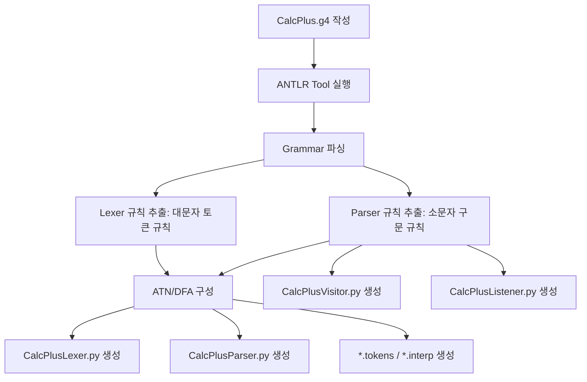
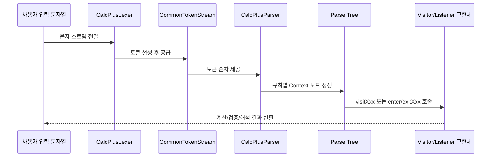
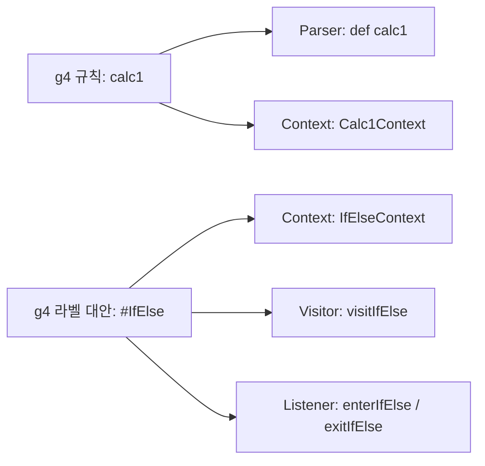

# CalcPlus.g4 -> Python 생성 파일 상세 해설

## 0) 전제
이 문서는 `CalcPlus.g4`를 기준으로, ANTLR이 Python 타깃으로 생성한 파일들의 역할과 메서드 동작을 상세하게 설명합니다.

생성 명령 예시:

```bash
antlr4 -Dlanguage=Python3 -visitor -listener CalcPlus.g4
```

대체 명령(환경별):

```bash
java -jar antlr-4.9.2-complete.jar -Dlanguage=Python3 -visitor -listener CalcPlus.g4
```

## 1) 생성 파일 전체 목록과 용도

### 1-1. 코드 파일(.py)
- `CalcPlusLexer.py`: 입력 문자열을 토큰으로 자르는 렉서
- `CalcPlusParser.py`: 토큰 스트림을 문법 규칙대로 파싱하는 파서
- `CalcPlusVisitor.py`: 트리 순회(방문)용 기본 뼈대
- `CalcPlusListener.py`: 트리 진입/종료 이벤트 콜백용 기본 뼈대

### 1-2. 메타 데이터 파일(.tokens/.interp)
- `CalcPlus.tokens`: 파서 기준 토큰 번호 매핑
- `CalcPlusLexer.tokens`: 렉서 기준 토큰 번호 매핑
- `CalcPlus.interp`: 파서 인터프리터용 내부 상태 정보
- `CalcPlusLexer.interp`: 렉서 인터프리터용 내부 상태 정보

주의:
- `.tokens`, `.interp`는 기계가 읽는 포맷이라 임의 주석 추가 시 도구 호환성이 깨질 수 있습니다.
- 따라서 상세 설명은 이 문서에 유지하고, 코드 주석은 `.py` 생성 파일에 집중하는 방식이 안전합니다.

## 2) 코드 생성 과정 도식

### 2-1. 생성 파이프라인(정적 생성 단계)


### 2-2. 실행 시점 파싱 흐름(동적 런타임 단계)


### 2-3. 규칙 이름 -> 코드 이름 변환 규칙


## 3) g4 규칙과 생성 코드 매핑표
| g4 요소 | Parser | Visitor | Listener |
|---|---|---|---|
| `calc0` | `calc0()`, `Calc0Context` | `visitCalc0` | `enterCalc0` / `exitCalc0` |
| `expr` | `expr()`, `ExprContext` | 라벨별 visit로 분기 | 라벨별 enter/exit로 분기 |
| `#MulDiv` | `MulDivContext` | `visitMulDiv` | `enterMulDiv` / `exitMulDiv` |
| `#AddSub` | `AddSubContext` | `visitAddSub` | `enterAddSub` / `exitAddSub` |
| `#Int` | `IntContext` | `visitInt` | `enterInt` / `exitInt` |
| `#Var` | `VarContext` | `visitVar` | `enterVar` / `exitVar` |
| `#Parens` | `ParensContext` | `visitParens` | `enterParens` / `exitParens` |
| `calc1` | `calc1()`, `Calc1Context` | `visitCalc1` | `enterCalc1` / `exitCalc1` |
| `stmt` | `stmt()`, `StmtContext` | 라벨별 visit로 분기 | 라벨별 enter/exit로 분기 |
| `#ExprAssign` | `ExprAssignContext` | `visitExprAssign` | `enterExprAssign` / `exitExprAssign` |
| `#IfElse` | `IfElseContext` | `visitIfElse` | `enterIfElse` / `exitIfElse` |
| `calc2` | `calc2()`, `Calc2Context` | `visitCalc2` | `enterCalc2` / `exitCalc2` |
| `cond` | `cond()`, `CondContext` | `visitCond` | `enterCond` / `exitCond` |
| `block` | `block()`, `BlockContext` | `visitBlock` | `enterBlock` / `exitBlock` |

## 4) 파일별 메서드 상세 설명

## 4-1. `CalcPlusLexer.py`

### 핵심 함수/메서드
| 이름 | 역할 | 하는 일 |
|---|---|---|
| `serializedATN()` | 렉서 상태기계 직렬 데이터 제공 | 정수 배열 형태의 ATN 데이터를 반환 |
| `CalcPlusLexer.__init__(input, output)` | 렉서 런타임 초기화 | 버전 체크, `LexerATNSimulator` 연결, action/predicate 슬롯 초기화 |

### 핵심 상수/테이블
- `T__0` ~ `T__17`: 리터럴 토큰(`*`, `/`, `if`, `{`, `}` 등) 번호
- `WS`, `INT`, `VAR`: 명시 렉서 규칙 토큰 번호
- `literalNames`: 리터럴 문자열 테이블
- `symbolicNames`: 이름 기반 토큰 테이블
- `ruleNames`: 렉서 규칙 이름 목록

## 4-2. `CalcPlusParser.py`

### 파싱 시작/핵심 규칙 메서드
| 메서드 | 역할 | 하는 일 |
|---|---|---|
| `calc0()` | 식 전용 엔트리 | `expr` 1개 + `EOF`를 강제 |
| `expr(_p=0)` | 수식 파싱 핵심 | 기저 대안(INT/VAR/괄호) 파싱 후, 우선순위 조건으로 좌재귀 확장 |
| `calc1()` | 문장 전용 엔트리1 | `stmt` 1개 이상 후 `EOF` 확인 |
| `stmt()` | 문장 분기 파싱 | 대입문(`#ExprAssign`) 또는 조건문(`#IfElse`) 분기 |
| `calc2()` | 문장 전용 엔트리2 | `calc1`과 유사하지만 별도 시작 규칙 |
| `cond()` | 비교식 파싱 | `expr` + 비교연산자 + `expr` 구조 검증 |
| `block()` | 블록 파싱 | `{` 와 `}` 사이의 0개 이상 `stmt` 파싱 |
| `sempred()` | predicate 분배기 | 좌재귀 규칙의 우선순위 predicate 함수로 라우팅 |
| `expr_sempred()` | 우선순위 게이트 | `MulDiv`(높은 우선순위), `AddSub`(그보다 낮은 우선순위) 적용 |

### Context 공통 메서드 패턴
| 메서드 | 역할 | 하는 일 |
|---|---|---|
| `getRuleIndex()` | 규칙 ID 반환 | 현재 Context가 어떤 규칙인지 런타임이 식별 가능하게 함 |
| `enterRule(listener)` | Listener 진입 훅 | 해당 `enterXxx` 메서드가 있으면 호출 |
| `exitRule(listener)` | Listener 종료 훅 | 해당 `exitXxx` 메서드가 있으면 호출 |
| `accept(visitor)` | Visitor 분배 훅 | 해당 `visitXxx`가 있으면 호출, 없으면 자식 방문 |
| `copyFrom(ctx)` | Context 복사 | 라벨 대안 Context로 변환 시 부모 정보 복사 |

### Context 접근자 메서드 패턴
| 메서드 예 | 역할 | 하는 일 |
|---|---|---|
| `expr()` / `stmt()` / `cond()` / `block()` | 하위 규칙 Context 접근 | 자식 규칙 노드 참조를 반환 |
| `INT()` / `VAR()` / `EOF()` | 터미널 토큰 접근 | 특정 토큰 노드 객체를 반환 |

## 4-3. `CalcPlusVisitor.py`

### Visitor 메서드
| 메서드 | 역할 | 하는 일 |
|---|---|---|
| `visitCalc0` | 식 엔트리 방문 | 기본은 자식 방문 |
| `visitMulDiv` | 곱셈/나눗셈 방문 | 기본은 자식 방문 |
| `visitAddSub` | 덧셈/뺄셈 방문 | 기본은 자식 방문 |
| `visitVar` | 변수 참조 방문 | 기본은 자식 방문 |
| `visitParens` | 괄호식 방문 | 기본은 자식 방문 |
| `visitInt` | 정수 리터럴 방문 | 기본은 자식 방문 |
| `visitCalc1` | 문장 엔트리 방문 | 기본은 자식 방문 |
| `visitExprAssign` | 대입문 방문 | 기본은 자식 방문 |
| `visitIfElse` | 조건문 방문 | 기본은 자식 방문 |
| `visitCalc2` | 문장 엔트리2 방문 | 기본은 자식 방문 |
| `visitCond` | 비교조건 방문 | 기본은 자식 방문 |
| `visitBlock` | 블록 방문 | 기본은 자식 방문 |

실전 팁:
- 계산기 구현은 `visitInt`, `visitVar`, `visitMulDiv`, `visitAddSub`를 주로 오버라이드합니다.
- 인터프리터 구현은 `visitExprAssign`, `visitIfElse`, `visitBlock`를 함께 오버라이드합니다.

## 4-4. `CalcPlusListener.py`

### Listener 콜백 메서드
| 메서드 | 역할 | 하는 일 |
|---|---|---|
| `enterCalc0` / `exitCalc0` | 식 엔트리 이벤트 | 진입/종료 시점 처리 |
| `enterMulDiv` / `exitMulDiv` | 곱/나눗셈 이벤트 | 진입/종료 시점 처리 |
| `enterAddSub` / `exitAddSub` | 덧/뺄셈 이벤트 | 진입/종료 시점 처리 |
| `enterVar` / `exitVar` | 변수 이벤트 | 진입/종료 시점 처리 |
| `enterParens` / `exitParens` | 괄호 이벤트 | 진입/종료 시점 처리 |
| `enterInt` / `exitInt` | 정수 이벤트 | 진입/종료 시점 처리 |
| `enterCalc1` / `exitCalc1` | 문장 엔트리 이벤트 | 진입/종료 시점 처리 |
| `enterExprAssign` / `exitExprAssign` | 대입문 이벤트 | 진입/종료 시점 처리 |
| `enterIfElse` / `exitIfElse` | 조건문 이벤트 | 진입/종료 시점 처리 |
| `enterCalc2` / `exitCalc2` | 문장 엔트리2 이벤트 | 진입/종료 시점 처리 |
| `enterCond` / `exitCond` | 비교식 이벤트 | 진입/종료 시점 처리 |
| `enterBlock` / `exitBlock` | 블록 이벤트 | 진입/종료 시점 처리 |

실전 팁:
- 스코프가 필요한 경우 `enterBlock`에서 push, `exitBlock`에서 pop을 수행합니다.
- 경고 수집은 `enterIfElse`, `enterExprAssign`에서 문맥 검사 후 리스트에 누적하는 방식이 좋습니다.

## 5) 토큰 번호/이름 대응 이해 포인트
- 파서 파일의 `T__N` 번호는 리터럴 토큰의 내부 번호입니다.
- `INT`, `VAR`처럼 이름 있는 토큰은 렉서 규칙 이름과 1:1 대응됩니다.
- `literalNames`, `symbolicNames`, `.tokens` 파일이 서로 같은 체계를 공유합니다.

## 6) 생성 코드 유지보수 시 주의사항
- 생성 파일 직접 수정은 재생성 시 사라질 수 있습니다.
- 안정적으로 유지하려면 아래 원칙을 권장합니다.
  1. 문법 변경은 `CalcPlus.g4`에서 수행
  2. 실행 로직은 사용자 코드(`*_visitor.py`, `*_listener.py`)에 작성
  3. 생성 파일 주석/학습자료는 본 문서와 함께 관리

## 7) 유치원생 버전
문법 파일은 "레고 설명서"이고, ANTLR은 설명서를 보고 자동 로봇을 만들어요.

- `Lexer` 로봇: 글자를 작은 조각(토큰)으로 잘라요.
- `Parser` 로봇: 잘린 조각을 규칙대로 나무 모양으로 쌓아요.
- `Visitor` 로봇: 나무를 돌아다니며 계산해요.
- `Listener` 로봇: 나무에 들어갈 때/나올 때 "지금 여기!"를 알려줘요.

그래서 g4에 `#IfElse`라고 이름표를 붙이면,
파이썬 코드에 `visitIfElse`, `enterIfElse`, `exitIfElse`가 자동으로 생겨요.
