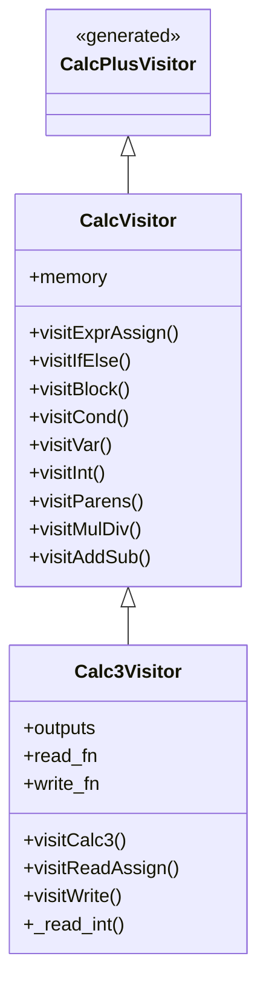
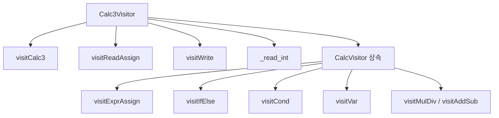
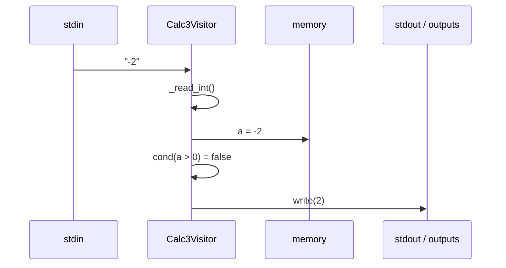
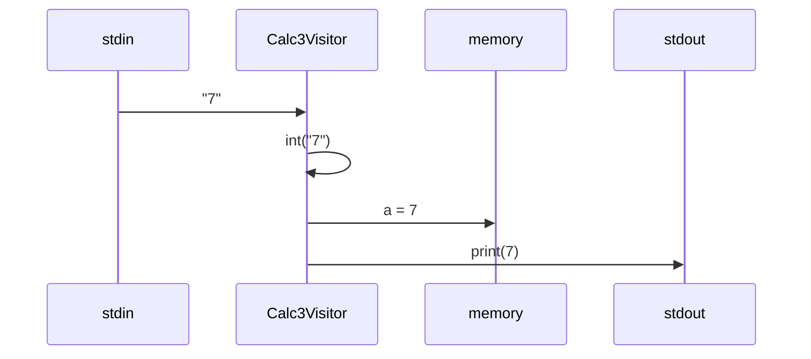
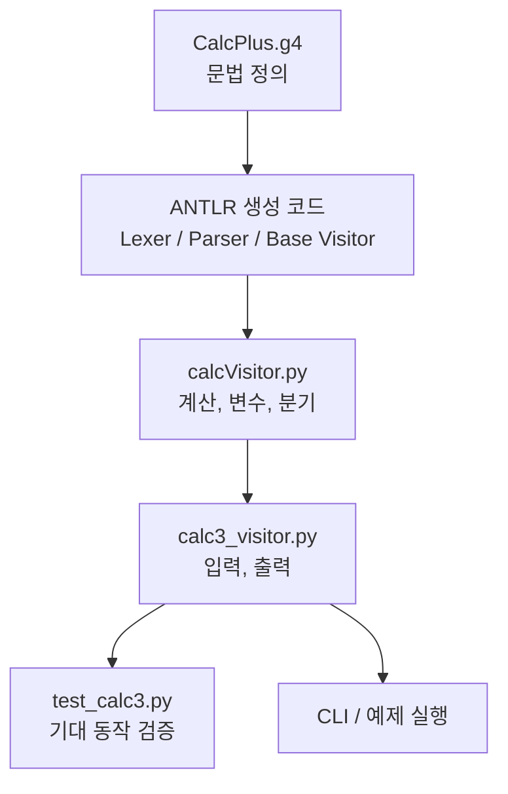

# Calc3 해설

## 개요

`Calc3`는 작은 계산기 언어를 단계적으로 확장한 버전 중, `입력(read)`과 `출력(write)`까지 도입한 단계다.

기준이 되는 이전 단계는 `Calc2`이며, `Calc2`가 이미 제공하던 기능은 다음과 같다.

- 정수 계산
- 변수 저장/재할당
- 미정의 변수 기본값 `0`
- `if / else` 분기

`Calc3`는 이 기반 위에 다음 두 기능을 추가한다.

- `a = read();`
- `write(expr);`

즉, `Calc3`의 핵심 목표는 "계산만 하던 언어를 실제 입력과 출력을 받는 프로그램 형태로 확장하는 것"이다.

## 문법 구조

문법은 [`CalcPlus.g4`](/home/jake/project/CS/compiler/rancho/CalcPlus/Calc3/CalcPlus.g4) 에 정의되어 있다.

루트 규칙은 다음과 같다.

```antlrv4
calc3   :   (stmt)+ EOF;
```

즉, `Calc3` 프로그램은 하나 이상의 문장 `stmt`로 구성된다.

`stmt`는 네 가지를 지원한다.

```antlrv4
stmt    :   VAR '=' expr ';'                    # ExprAssign
        |   VAR '=' 'read' '(' ')' ';'          # ReadAssign
        |   'if' '(' cond ')' thenBlock=block
            ('else' elseBlock=block)?           # IfElse
        |   'write' '(' expr ')' ';'            # Write
        ;
```

각 의미는 다음과 같다.

- `ExprAssign`: 일반 대입문
- `ReadAssign`: 입력을 받아 변수에 저장하는 문장
- `IfElse`: 조건 분기
- `Write`: 수식 값을 출력하는 문장

중요한 제약도 하나 있다.

- `read()`는 수식 안에 들어갈 수 없다.
- 오직 `VAR = read();` 형태로만 허용된다.

따라서 아래 코드는 허용되지 않는다.

```calc
a = read() + 1;
```

반드시 이렇게 나누어야 한다.

```calc
a = read();
b = a + 1;
```

## 실행 구조

실행 흐름은 일반적인 ANTLR 기반 인터프리터 구조를 따른다.

1. 소스 코드를 입력 스트림으로 만든다.
2. `CalcPlusLexer`가 토큰으로 분해한다.
3. `CalcPlusParser.calc3()`가 파스 트리를 만든다.
4. Visitor가 트리를 순회하면서 실제 의미를 실행한다.

이 프로젝트에서 계산과 분기의 기본 동작은 [`calcVisitor.py`](/home/jake/project/CS/compiler/rancho/CalcPlus/Calc3/calcVisitor.py) 가 맡고 있다.

### 실행 흐름 도식

```mermaid
flowchart LR
    A[Calc3 소스 코드] --> B[InputStream]
    B --> C[CalcPlusLexer]
    C --> D[CommonTokenStream]
    D --> E[CalcPlusParser.calc3()]
    E --> F[Parse Tree]
    F --> G[Calc3Visitor.visit(tree)]
    G --> H[memory 최종 상태]
    G --> I[stdout 출력]
```

## 부모 Visitor가 담당하는 기능

[`CalcVisitor`](/home/jake/project/CS/compiler/rancho/CalcPlus/Calc3/calcVisitor.py#L6) 는 `Calc2`까지의 핵심 semantics를 구현한다.

### Visitor 역할 분리 도식



### 1. 변수 메모리

```python
self.memory: dict[str, int] = {}
```

프로그램 실행 중 변수 상태를 이 딕셔너리에 저장한다.

### 2. 일반 대입

[`visitExprAssign`](/home/jake/project/CS/compiler/rancho/CalcPlus/Calc3/calcVisitor.py#L55) 는 다음 흐름으로 동작한다.

1. 왼쪽 변수 이름을 읽는다.
2. 오른쪽 수식을 계산한다.
3. 계산 결과를 `memory`에 저장한다.

예:

```calc
a = 1 + 2;
```

실행 후:

```text
memory["a"] == 3
```

### 3. 조건문

[`visitIfElse`](/home/jake/project/CS/compiler/rancho/CalcPlus/Calc3/calcVisitor.py#L64) 는 조건을 먼저 계산한 뒤,

- 참이면 `thenBlock`
- 거짓이면 `elseBlock`이 있을 때만 실행

하도록 되어 있다.

즉 두 블록을 모두 실행하지 않고, 반드시 한쪽만 실행한다.

### 4. 블록

[`visitBlock`](/home/jake/project/CS/compiler/rancho/CalcPlus/Calc3/calcVisitor.py#L78) 는 블록 안의 문장들을 순서대로 방문한다.

별도의 지역 스코프는 없으므로, 블록 내부의 변수 변경은 전역 `memory`에 그대로 반영된다.

### 5. 비교식

[`visitCond`](/home/jake/project/CS/compiler/rancho/CalcPlus/Calc3/calcVisitor.py#L84) 는 다음 비교 연산을 처리한다.

- `==`
- `!=`
- `>`
- `>=`
- `<`
- `<=`

조건식은 항상 `expr op expr` 형태다.

### 6. 변수 조회

[`visitVar`](/home/jake/project/CS/compiler/rancho/CalcPlus/Calc3/calcVisitor.py#L104) 는 아직 정의되지 않은 변수를 읽으면 `0`으로 자동 초기화한다.

예:

```calc
a = b + 3;
```

처음 `b`를 읽는 시점에 `b == 0`으로 간주된다.

그래서 결과는 다음과 같다.

```text
a == 3
b == 0
```

### 7. 산술식

[`visitInt`](/home/jake/project/CS/compiler/rancho/CalcPlus/Calc3/calcVisitor.py#L111), [`visitParens`](/home/jake/project/CS/compiler/rancho/CalcPlus/Calc3/calcVisitor.py#L115), [`visitMulDiv`](/home/jake/project/CS/compiler/rancho/CalcPlus/Calc3/calcVisitor.py#L119), [`visitAddSub`](/home/jake/project/CS/compiler/rancho/CalcPlus/Calc3/calcVisitor.py#L127) 가 수식을 계산한다.

이 덕분에 다음이 모두 가능하다.

- 정수 리터럴
- 변수 참조
- 괄호
- 사칙연산 우선순위

예:

```calc
a = 10 + 2 * (5 - 9 / 3);
```

## Calc3에서 추가되는 부분

`Calc3`는 기존 `CalcVisitor`를 그대로 쓰면서, 입출력 관련 메서드만 추가하는 방식으로 설계되어 있다.

이 역할을 하는 파일이 [`calc3_visitor.py`](/home/jake/project/CS/compiler/rancho/CalcPlus/Calc3/calc3_visitor.py) 다.

의도된 구조는 다음과 같다.

- `visitCalc3`
- `visitReadAssign`
- `visitWrite`
- `_read_int`

### 1. `visitCalc3`

루트 규칙 `calc3 : stmt+ EOF` 를 실행한다.

의미는 단순하다.

1. 모든 문장을 순서대로 실행
2. 마지막에 메모리 사본 반환

즉 프로그램의 결과는 "마지막 변수 상태"다.

### 2. `visitReadAssign`

이 메서드는 다음 문장을 처리한다.

```calc
a = read();
```

동작은 다음과 같다.

1. 입력에서 값 하나를 읽는다.
2. 정수로 변환한다.
3. 변수 `a`에 저장한다.

문서와 테스트 기준 정책은 다음과 같다.

- EOF면 `0`
- 빈 문자열이면 `0`
- 공백 문자열이면 `0`
- 정수 변환 실패면 `0`

즉 `read()`는 "정수 하나를 읽되 실패하면 0"이라는 안전한 정책을 가진다.

### 3. `visitWrite`

이 메서드는 다음 문장을 처리한다.

```calc
write(a + 1);
```

동작은 다음과 같다.

1. 내부 `expr`를 계산한다.
2. 결과를 출력 함수로 보낸다.
3. 테스트 검증용 `outputs` 버퍼에도 저장한다.

즉 `write()`는 값을 반환하는 함수라기보다, 부수효과를 가진 출력 문장이다.

그래서 아래처럼 쓰는 것은 문법상 허용되지 않는다.

```calc
c = write(a);
```

### 문장 종류 도식

```mermaid
flowchart TD
    S[stmt] --> A[ExprAssign<br/>VAR = expr;]
    S --> B[ReadAssign<br/>VAR = read();]
    S --> C[IfElse<br/>if cond thenBlock elseBlock]
    S --> D[Write<br/>write(expr);]
```

### 의미 분담 도식



## 예제 실행 흐름

아래 프로그램을 보자.

```calc
a = read();
if (a > 0) {
    write(a);
} else {
    write(0 - a);
}
```

입력값이 `-2` 라고 가정하면 실행 흐름은 다음과 같다.

1. `read()`가 `-2`를 읽는다.
2. `a = -2` 저장
3. 조건 `a > 0` 평가
4. 결과는 거짓
5. `else` 블록 실행
6. `0 - a` 계산 결과는 `2`
7. `2` 출력

최종 상태는 다음과 같다.

```text
memory == {"a": -2}
outputs == [2]
```

### 예제 실행 도식

```mermaid
flowchart TD
    A[시작] --> B[a = read()]
    B --> C[a에 -2 저장]
    C --> D{a > 0 ?}
    D -->|참| E[write(a)]
    D -->|거짓| F[write(0 - a)]
    F --> G[2 출력]
    E --> H[종료]
    G --> H
```

### 상태 변화 도식



## 예제 모음

### 예제 1. 고정값 출력

```calc
a = 40;
b = a + 2;
write(b);
```

실행 결과:

```text
stdout: 42
memory: {"a": 40, "b": 42}
outputs: [42]
```

실행 흐름:

```mermaid
flowchart LR
    A[a = 40] --> B[b = a + 2]
    B --> C[write(b)]
    C --> D[42 출력]
```

### 예제 2. 입력값 그대로 출력

```calc
a = read();
write(a);
```

입력이 `7` 이면:

```text
stdout: 7
memory: {"a": 7}
outputs: [7]
```

실행 흐름:

1. `read()`가 stdin에서 한 줄을 읽는다.
2. 읽은 문자열을 정수로 바꾼다.
3. 그 값을 `a`에 저장한다.
4. `write(a)`가 `a`의 값을 출력한다.



### 예제 3. 입력 후 조건 분기

```calc
a = read();
if (a >= 0) {
    write(a);
} else {
    write(0 - a);
}
```

입력이 `5` 이면:

```text
stdout: 5
memory: {"a": 5}
outputs: [5]
```

입력이 `-5` 이면:

```text
stdout: 5
memory: {"a": -5}
outputs: [5]
```

즉 이 프로그램은 "정수의 절댓값 출력"처럼 동작한다.

실행 흐름:

```mermaid
flowchart TD
    A[a = read()] --> B{a >= 0 ?}
    B -->|yes| C[write(a)]
    B -->|no| D[write(0 - a)]
    C --> E[출력 후 종료]
    D --> E
```

### 예제 4. 미정의 변수 기본값 사용

```calc
a = b + 3;
write(a);
write(b);
```

실행 결과:

```text
stdout: 3
stdout: 0
memory: {"b": 0, "a": 3}
outputs: [3, 0]
```

이 예제에서 `b`는 처음 등장했을 때 자동으로 `0`이 된다.

실행 흐름:

1. `b` 조회
2. `b`가 없으므로 `memory["b"] = 0`
3. `a = 0 + 3`
4. `write(a)`는 `3` 출력
5. `write(b)`는 `0` 출력

## 단계별 실행 추적 예시

아래 프로그램을 기준으로 상태가 어떻게 바뀌는지 보자.

```calc
a = 1;
b = a + 2;
if (b > 2) {
    write(b);
} else {
    write(0);
}
```

### 단계별 표

| 단계 | 실행 문장 | memory 변화 | outputs 변화 |
|---|---|---|---|
| 1 | `a = 1;` | `{"a": 1}` | `[]` |
| 2 | `b = a + 2;` | `{"a": 1, "b": 3}` | `[]` |
| 3 | `if (b > 2)` 조건 평가 | 변화 없음 | `[]` |
| 4 | `write(b);` 실행 | 변화 없음 | `[3]` |

최종 결과:

```text
memory: {"a": 1, "b": 3}
outputs: [3]
stdout: 3
```

### 단계별 추적 도식

```mermaid
flowchart TD
    A[초기 상태<br/>memory = {}] --> B[a = 1]
    B --> C[memory = {a: 1}]
    C --> D[b = a + 2]
    D --> E[memory = {a: 1, b: 3}]
    E --> F{b > 2 ?}
    F -->|true| G[write(3)]
    F -->|false| H[write(0)]
    G --> I[outputs = [3]]
    H --> I
```

## 입력 실패 예제

`Calc3`의 `read()`는 실패 시 `0`으로 처리하는 정책을 가진다.

```calc
a = read();
write(a);
```

입력이 `"abc"` 이면:

```text
stdout: 0
memory: {"a": 0}
outputs: [0]
```

입력이 빈 문자열이거나 EOF여도 같은 결과를 기대한다.

실행 흐름:

```mermaid
flowchart LR
    A[read()] --> B{정수 변환 가능?}
    B -->|yes| C[입력값 저장]
    B -->|no| D[0 저장]
    C --> E[write(a)]
    D --> E
```

## 테스트가 보여주는 기대 동작

[`test_calc3.py`](/home/jake/project/CS/compiler/rancho/CalcPlus/Calc3/test_calc3.py) 는 `Calc3`의 기대 계약을 보여준다.

핵심 테스트 포인트는 다음과 같다.

- 기본 대입 + 조건문 + 출력이 동작해야 한다.
- 음수 입력일 때 `else` 분기가 실행되어야 한다.
- 잘못된 입력은 `0`으로 처리해야 한다.
- 출력은 실제 출력 함수 호출과 `outputs` 버퍼 누적이 동시에 일어나야 한다.

즉 이 테스트는 `Calc3`의 명세 역할도 한다.

## 현재 코드 상태에서 중요한 점

현재 저장소 기준으로 보면 [`calc3_visitor.py`](/home/jake/project/CS/compiler/rancho/CalcPlus/Calc3/calc3_visitor.py#L13) 는 아직 `...` 로 남아 있는 스켈레톤 상태다.

즉 다음 요소는 준비되어 있다.

- 문법
- 부모 visitor의 계산/분기 로직
- 테스트
- 설명 문서

하지만 실제 `Calc3Visitor` 구현은 아직 완성되지 않았다.

따라서 이 프로젝트를 학습하는 관점에서는 아래 순서로 이해하면 된다.

1. `CalcPlus.g4`로 문장 형태를 이해한다.
2. `calcVisitor.py`로 계산/변수/분기 semantics를 이해한다.
3. `calc3_visitor.py`에서 입출력만 덧붙이면 된다는 점을 이해한다.
4. `test_calc3.py`로 구현 목표를 검증한다.

## 한 줄 요약

`Calc3`는 `Calc2`의 계산기 인터프리터에 `read()`와 `write()`를 추가해서, 외부 입력을 읽고 결과를 출력할 수 있게 만든 단계다.

## 빠른 전체 그림


