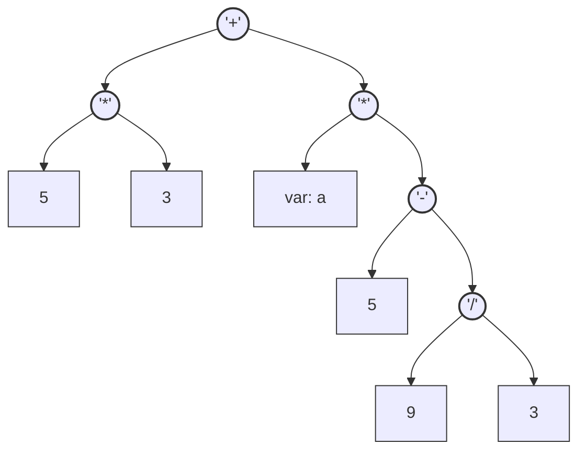
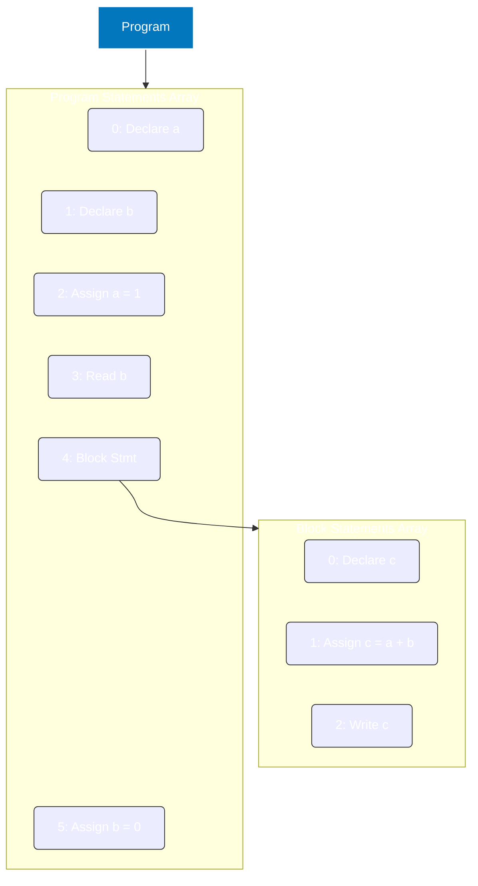

## [Calc-5](https://github.com/2025-Compiler-Study/calc-plus-ref/tree/calc5)

이번에는 언어 스펙은 건드리지 않는다.  
이제 Parse Tree 순회 시 즉시 실행이 아닌 AST를 구성하고 실행하게 한다.

```antlrv4
grammar CalcPlus;

program :   (stmt)+ EOF;

stmt    :   'int' VAR (',' VAR)* ';'            # Declare
        |   VAR '=' expr ';'                    # ExprAssign
        |   VAR '=' 'read' '(' ')' ';'          # ReadAssign
        |   'write' '(' expr ')' ';'            # Write
        |   'if' '(' cond ')' thenBlock=block
            ('else' elseBlock=block)?           # IfElse
        |   block                               # StmtBlock
        ;

expr    :   expr ('*'|'/') expr # MulDiv
        |   expr ('+'|'-') expr # AddSub
        |   INT                 # Int
        |   VAR                 # Var
        |   '(' expr ')'        # Parens
        ;

cond    :   expr ('=='|'!='|'>'|'>='|'<'|'<=') expr ;
block   :   '{' (stmt)* '}' ;

WS  : [ \t\r\n]+ -> skip;
INT : [0-9]+ ;
VAR : [A-Za-z]+ ;
```

* 이제부터 프로그래밍 언어의 진입 문법은 `program`으로 통일한다.
* 아래 구현 과제를 직관적으로 볼 수 있도록 일부 순서를 정리했다.
* 기존 `calc0`부터 `calc4`까지는 반복으로 사실상 무의미하므로 정리한다.
* 기존 구현 및 테스트 코드는 삭제해도 된다. (문법에 맞춰 유지해보는 것도 좋음)

### 구현 과제 #1

1. AST의 구성 요소를 생각하고 구현해야 한다.
2. ANTLR로 작성한 문법에서 의미를 가지는 시맨틱한 부분이 AST의 노드가 된다.
3. Parse Tree에서 AST로 변환 시 보통 구성 요소가 줄어들지만, 늘어날 수도 있다.
4. 이전 과제의 테스트용 작성 코드를 AST로 구성하면 어떻게 될 지 직접 구성해본다.

힌트: 프로그램 진입 지점(`program`)부터 노드를 구성해보고, 의미에 따라 병합/분리한다.

고려사항: `expr` 계산을 단순화 하기 위한 방법으로 후위표기법 등을 고려할 수도 있으나, 가독성이나 구현 개념 일치를 위해 일반 트리로 그리는 것을 추천한다.

#### 예제 #1

```
5 * 3 + a * (5 - 9 / 3)
```

위와 같은 수식을 AST로 구성하는 예시 중 하나는 아래와 같다. (동일할 필요는 없다.)



1. 괄호가 존재하지 않는다.
2. "곱하기, 나누기" 와 "더하기, 빼기"를 구분하지 않고 표현한다.
3. 연산자의 왼쪽과 오른쪽 값에는 연산, int, var이 들어갈 수 있다.

AST 트리를 구성하는 과정에서 우선순위 여부가 트리 자체에 녹아있다.  
트리의 자식 -> 부모 순으로 연산이 우선 처리되어야 한다.  
left, right 자리에 연산, int, var를 모두 넣을 수 있어야 한다. (인터페이스 형변환)

#### 예제 #2

```
int a, b;
a = 1;
b = read();
{
  int c;
  c = a + b;
  write(c);
}
b = 0;
```

위와 같은 코드를 AST로 구성하는 예시 중 하나는 아래와 같다. (동일할 필요는 없다.)



1. Program 안에 각 statement에 해당하는 값은 배열로 취급된다.
2. 문법 상으로는 한 문장에서 2개 변수를 선언했지만, AST에서는 각각 선언한다.

AST가 Abstract Syntax Tree지만 꼭 Binary Tree로 구성될 필요는 없다.  
다만 각 노드가 배열로 표현될 때, 그 순서는 중요하다.

#### 힌트

* 문법의 제약사항을 너무 과도하게 구현하려 할 필요 없다.  
  AST는 코드의 의미에 대한 핵심을 담은 것일 뿐이며, 기존 파스 트리를 재해석한 내용이다.  
  문법의 제약사항은 파스 트리가 나타내며, AST로 변환할 때 의미가 맞는지 다시 판단해도 된다.  
  표현하는 대상이나 의미가 비슷하다면 기존 파스 트리/문법 요소를 통합/분리해도 된다.
* ANTLR로 작성한 문법을 보면, 프로그램은 여러 개의 문장(statement)으로 구성되어 있다.  
  즉, 현재 문법에서 AST의 최상위 노드는 문장을 여러 개 들고 있을 수 있어야 한다.
* 문장의 종류는 선언(declare), 할당(assign), 읽기(read), 쓰기(write), 조건문(if-else), 코드블록(block)이 있다.
* 할당(assign)의 경우, 오른쪽의 표현(expression)이 계산 완료되어야 할당을 할 수 있다.  
  즉, 할당 노드의 자식은 왼쪽에 변수, 오른쪽에 표현이 들어갈 수 있다.
* 읽기에 대한 의미를 생각해보면 입력을 받은 값을 반환했을때 변수에 값을 할당하는 방식이다.  
  즉, read 함수 호출이 표현(expression)의 일종이라고 생각할 수 있다.  
  좀 더 생각해보면 할당과 읽기가 하나의 문장 종류로 취급 될 수 있다.
* 쓰기의 경우 함수는 호출했지만, 값을 어딘가에 반환하지 않았다.  
  앞에서 read 함수 호출을 표현(expression)으로 취급했듯, write함수도 호출로 취급한다면  
  아래와 같이 생각해보고, 문장의 종류를 통합할 수도, 개별적으로 늘릴 수도 있다.
  1) 변수에 할당하지 않는, 표현 그 자체도 문장이 될 수 있어야 한다.
  2) 쓰기와 같이 표현의 값을 변수에 할당하지 않고 버리는 경우로 생각할 수도 있다.
* 문법 정의에서 조건문의 비교(cond)는 수식(expr)의 사칙연산과 완전히 다른 것으로 취급한다.  
  하지만 가운데 연산자를 두고 왼쪽 오른쪽 값을 비교하는 것은 사칙연산 표현과 비슷한 구조다.  
  부울 변수를 정수형으로 취급해서 true인 것을 1로 반환하고, false인 것을 0으로만 반환한다면  
  굳이 별도의 노드로 취급되지 않아도 된다.
* 함수 호출은 나중에 수정하게 될 가능성이 높다.  
  함수 호출에 대한 표현을 일반화 할 자신이 없다면  
  일단 수식으로 취급되면서, 수식을 입력받을 수 있는 노드로 생각하자.

### 구현 과제 #2

1. 이전 구현한 AST를 시각화하여 출력하는 기능을 추가한다.
2. 출력 방식은 본인이 편한 방법을 사용하면 된다.
3. 이 과제의 목적은 Parse Tree의 분석 결과가 일치하는지 쉽게 확인하기 위해서다.

힌트: 트리 구조를 출력하려면 트리 내 노드의 출력을 Visitor처럼 출력해줘야 한다.

아래 코드를 AST로 표현하고 출력하는 여러 방식을 참고하여 본인이 이해하기 쉽게 작성한다.

```
5 * 3 + a * (5 - 9 / 3)
```

LISP 방식은 전위 표기법과 비슷하다. (트리 깊이 관계 표현을 위해 괄호를 사용한다.)

```lisp
(+ (* 5 3) (* a (- 5 (/ 9 3))))
```

JSON 방식으로 표기해도 된다. (각 언어의 JSON marshaller, pretty print를 활용 가능)  

```json
{
  "type": "expr",
  "left": {
    "left": { "type": "int", "value": 5 },
    "op": "*",
    "right": { "type": "int", "value": 3 }
  },
  "op": "+",
  "right": {
    "type": "expr",
    "left": { "type": "var", "value": "a" },
    "op": "*",
    "right": {
      "type": "expr",
      "left": { "type": "int", "value": 5 },
      "op": "-",
      "right": {
        "type": "expr",
        "left": { "type": "int", "value": 9 },
        "op": "/",
        "right": { "type": "int", "value": 3 }
      }
    }
  }
}
```

혹은 Python이 들여쓰기 하듯이 출력하는 것도 방법이다.

```text
Left:
    Left:
        Value: 5
    Op: *
    Right:
        Value: 3
Op: +
Right:
    Left:
        Variable: a
    Op: *
    Right:
        Left:
            Value: 5
        Op: -
        Right:
            Left:
                Value: 9
            Op: /
            Right:
                Value: 3
```

출력 방식과 각 방식에서 표현되어야 하는 필드는 본인이 선택하면 된다.

### 구현 과제 #3

1. 앞의 AST로 구성된 코드를 실행해주는 Executor를 구현한다.
2. 변수 관리는 이전 Calc4에서 구현한 Symbol Table을 활용한다.
3. Parse tree 해석 및 순회 없이, 임의로 만든 AST만 실행하면 된다.
4. 만약 문맥상 문제가 있다면, 즉시 종료한다. (변수 재선언, 미선언 사용 등)

힌트: 기존 ANTLR가 생성한 Visitor를 참고해도 되고, AST 기반이라 더 단순해도 된다.

굳이 다시 AST로 구현하는 이유는 그 다음 Calc6에서 드러날 것이다.

### 구현 과제 #4

1. ANTLR로 만든 Parse tree를 순회하면서 AST를 구성하는 Builder를 구현한다.
2. Parse tree 순회 중 오류 발생 시 그 오류를 기록한다. (변수 재선언, 미선언 사용 등)
3. Parse tree를 전체 순회하고 나서 오류가 있다면 오류를 출력한다.
4. 오류가 없다면 과제 3의 Executor에 AST를 실행시킨다.

힌트: Executor도 Symbol Table이 필요하지만, Builder도 Symbol Table이 필요하다.
